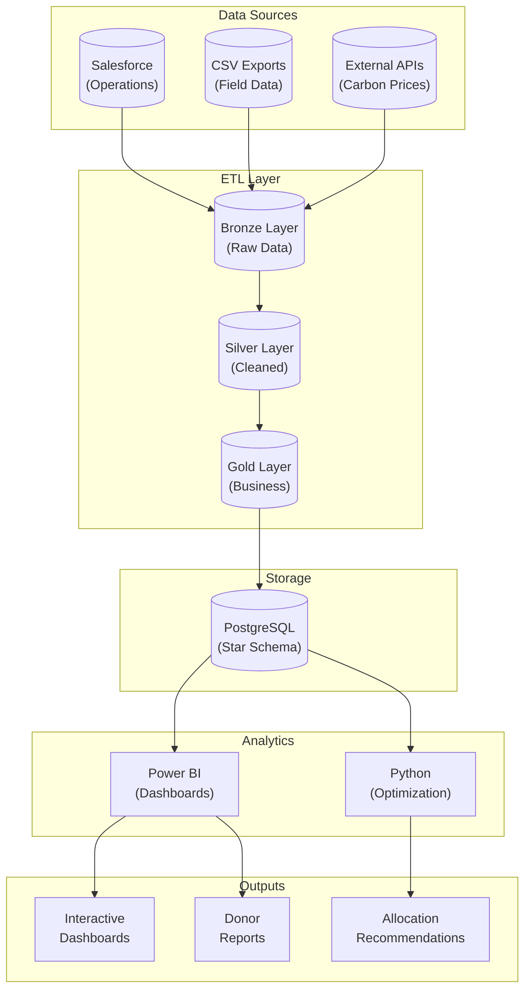
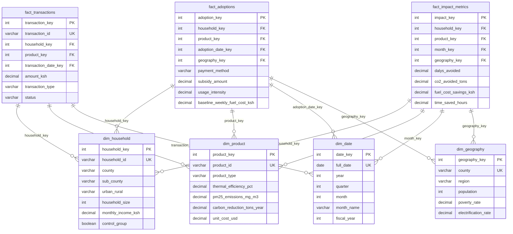
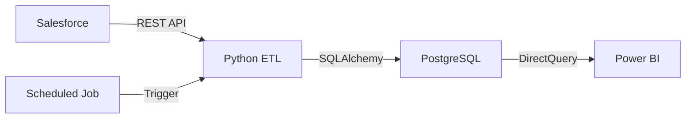

# System Architecture

This document describes the technical architecture of the Org X SIC Impact Measurement & ROI Analytics System.

## Solution Architecture

The system is designed to complement (not replace) Org X SIC's operational Salesforce platform by providing an analytics layer for strategic decision-making.



## Data Flow: Bronze → Silver → Gold

The system implements a Lakehouse architecture pattern with three data layers:

```mermaid
flowchart LR
    subgraph Bronze ["Bronze Layer (Raw)"]
        B1["Org X_households_200k.csv"]
        B2["financial_transactions.csv"]
        B3["product_performance_metrics.csv"]
        B4["carbon_credit_prices.csv"]
        B5["ebike_logistics_data.csv"]
    end
    
    subgraph Silver ["Silver Layer (Cleaned)"]
        S1["silver_households\n(validated, typed)"]
        S2["silver_adoption_metrics\n(counterfactual)"]
        S3["silver_impact_calculations\n(health, env, econ)"]
    end
    
    subgraph Gold ["Gold Layer (Business)"]
        G1["gold_executive_summary"]
        G2["gold_county_performance"]
        G3["gold_donor_health_impact"]
        G4["gold_donor_environment_impact"]
        G5["gold_donor_gender_impact"]
    end
    
    Bronze --> |raw_to_processed.py| Silver
    Silver --> |processed_to_final.py| Gold
```



### Layer Descriptions

| Layer | Purpose | Characteristics |
|-------|---------|-----------------|
| **Bronze** | Raw data preservation | Original format, no transformations, audit trail |
| **Silver** | Data quality & standardization | Validated, typed, deduplicated, enriched |
| **Gold** | Business-ready aggregations | Pre-calculated metrics, optimized for reporting |

## Star Schema Design

The data model follows a star schema pattern optimized for analytical queries:



### Dimension Tables

| Table | Description | Record Count |
|-------|-------------|--------------|
| `dim_household` | Household demographics and baseline data | 200,000 |
| `dim_product` | Product specifications and performance | 11 |
| `dim_date` | Date dimension (2023-2035) | 4,383 |
| `dim_geography` | Kenya county demographics | 14 |
| `dim_donor` | Donor profiles and focus areas | 4 |

### Fact Tables

| Table | Description | Record Count | Grain |
|-------|-------------|--------------|-------|
| `fact_adoptions` | Product distribution events | 81,423 | One row per household-product adoption |
| `fact_transactions` | Financial transactions | 251,168 | One row per transaction |
| `fact_impact_metrics` | Monthly impact aggregations | ~1.2M | One row per household-product-month |

## Salesforce Integration Approach

### Demo Mode (Current)

For this demonstration project, Salesforce data is simulated through CSV exports:


### Production Mode (Recommended)

For production deployment, two integration patterns are supported:

#### Option 1: Direct Power BI Connector


**Pros:** Simple setup, native connector  
**Cons:** Limited transformation, row limits

#### Option 2: ETL to PostgreSQL (Recommended)



**Pros:** Full transformation capability, scalable, audit trail  
**Cons:** Additional infrastructure, maintenance

See [SALESFORCE_INTEGRATION.md](SALESFORCE_INTEGRATION.md) for detailed implementation guide.

## Technology Rationale

| Component | Technology | Rationale |
|-----------|------------|-----------|
| **Database** | PostgreSQL | Open-source, robust analytics support, excellent Power BI integration |
| **ETL** | Python (pandas, SQLAlchemy) | Flexible transformations, data science ecosystem, Salesforce libraries |
| **Visualization** | Power BI | Industry standard, interactive, mobile support, DAX for complex calculations |
| **Optimization** | Python (PuLP) | Linear programming, reproducible, integrates with data pipeline |


## Security Considerations

| Concern | Mitigation |
|---------|------------|
| Database credentials | Environment variables (.env), never committed to git |
| PII data | Household names excluded from analytics layer |
| Row-level security | Power BI RLS can filter by county/region for field staff |
| Audit trail | Bronze layer preserves original data for compliance |

## Performance Optimization

### Database Level

```sql
-- Indexes on frequently filtered columns
CREATE INDEX idx_household_county ON OrgX.dim_household(county);
CREATE INDEX idx_adoptions_date ON OrgX.fact_adoptions(adoption_date_key);
CREATE INDEX idx_transactions_date ON OrgX.fact_transactions(transaction_date_key);
```

### Power BI Level

- **Star schema** – Minimizes joins for efficient queries
- **Aggregation tables** – Pre-calculated summaries for dashboard performance
- **DirectQuery for facts** – Import mode for dimensions
- **Calculated columns** – Minimal, prefer DAX measures

### ETL Level

- **Batch processing** – Full refresh for demo, incremental for production
- **Connection pooling** – SQLAlchemy engine reuse
- **Data types** – Proper typing reduces memory footprint
