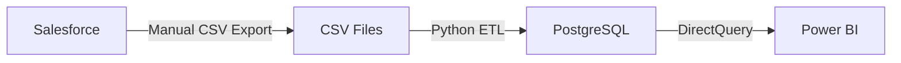
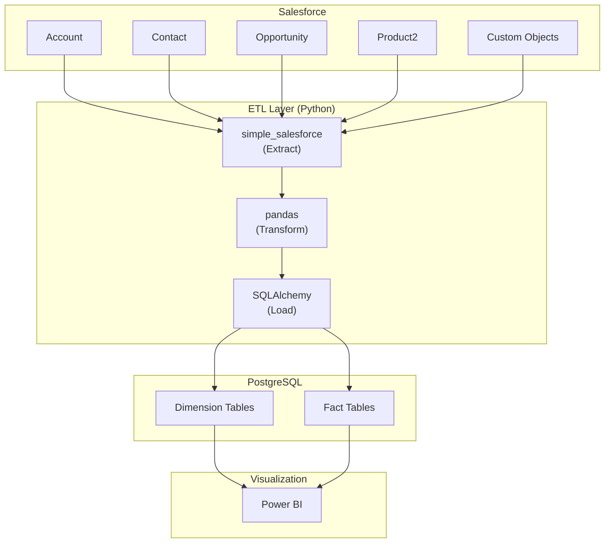

# Salesforce Integration Guide

This document provides a step-by-step guide for integrating Org X SIC's Salesforce CRM with the Impact Analytics system in a production environment.

## Table of Contents

- [Integration Patterns](#integration-patterns)
- [Option 1: Power BI Direct Connector](#option-1-power-bi-direct-connector)
- [Option 2: ETL to PostgreSQL](#option-2-etl-to-postgresql-recommended)
- [Salesforce Object Mapping](#salesforce-object-mapping)
- [API Considerations](#api-considerations)
- [Security Configuration](#security-configuration)

---

## Integration Patterns

### Current Demo Implementation



### Production Options

**Option 1:** Power BI Salesforce Connector (Simple)
**Option 2:** ETL to PostgreSQL (Recommended for scale)

---

## Option 1: Power BI Direct Connector

### Prerequisites

- Power BI Pro or Premium license
- Salesforce account with API access
- Connected App configured in Salesforce

### Step-by-Step Setup

#### 1. Create Salesforce Connected App

1. In Salesforce Setup, navigate to **App Manager**
2. Click **New Connected App**
3. Configure:
   ```
   Connected App Name: Org X Power BI Integration
   API Name: Org X_Power_BI_Integration
   Contact Email: admin@Org Xsic.org
   Enable OAuth Settings: ✓
   Callback URL: https://oauth.powerbi.com/views/oauthredirect.html
   Selected OAuth Scopes:
     - Access and manage your data (api)
     - Perform requests on your behalf at any time (refresh_token, offline_access)
   ```
4. Save and note the **Consumer Key** and **Consumer Secret**

#### 2. Configure Power BI Connection

1. In Power BI Desktop, select **Get Data** → **Salesforce Objects**
2. Enter credentials:
   - Production: `https://login.salesforce.com`
   - Sandbox: `https://test.salesforce.com`
3. Authenticate using your Salesforce credentials
4. Select objects to import

#### 3. Select Salesforce Objects

| Salesforce Object | Analytics Usage | Import Mode |
|-------------------|-----------------|-------------|
| Account (Households) | Household dimension | Import |
| Contact | Head of household | Import |
| Product2 | Product dimension | Import |
| Opportunity | Adoptions | Import |
| OpportunityLineItem | Product distribution | DirectQuery |
| Custom: Usage_Monitoring__c | Impact metrics | DirectQuery |
| Custom: Transaction__c | Financial data | DirectQuery |

#### 4. Schedule Refresh

In Power BI Service:
1. Navigate to dataset settings
2. Under **Scheduled refresh**, configure:
   - Refresh frequency: Daily
   - Time: 5:00 AM (after Salesforce nightly processes)
   - Notification: On failure

### Limitations

| Limitation | Impact | Mitigation |
|------------|--------|------------|
| Row limit | 200K rows per query | Filter by date range |
| Query timeout | 10-minute limit | Simplify queries, use Import mode |
| API calls | 15,000/day (Enterprise) | Cache in Import mode |
| Data transformation | Limited in connector | Pre-process in Salesforce reports |

---

## Option 2: ETL to PostgreSQL (Recommended)

### Architecture



### Prerequisites

```bash
pip install simple-salesforce pandas sqlalchemy psycopg2-binary python-dotenv
```

### Step 1: Salesforce Authentication

```python
# salesforce_connector.py
from simple_salesforce import Salesforce
import os
from dotenv import load_dotenv

load_dotenv()

def get_salesforce_connection():
    """
    Authenticate to Salesforce using OAuth2.
    Credentials stored in environment variables.
    """
    sf = Salesforce(
        username=os.getenv('SF_USERNAME'),
        password=os.getenv('SF_PASSWORD'),
        security_token=os.getenv('SF_SECURITY_TOKEN'),
        domain='login'  # Use 'test' for sandbox
    )
    return sf
```

### Step 2: Extract Data

```python
# extract_salesforce.py
from salesforce_connector import get_salesforce_connection
import pandas as pd

def extract_households():
    """Extract household data from Salesforce Account object."""
    sf = get_salesforce_connection()
    
    query = """
    SELECT 
        Id,
        Name,
        Household_ID__c,
        County__c,
        Sub_County__c,
        Ward__c,
        Village__c,
        Urban_Rural__c,
        GPS_Latitude__c,
        GPS_Longitude__c,
        Head_Gender__c,
        Head_Age__c,
        Household_Size__c,
        Children_Under_18__c,
        Monthly_Income__c,
        Control_Group__c,
        CreatedDate,
        LastModifiedDate
    FROM Account
    WHERE RecordType.Name = 'Household'
    AND LastModifiedDate >= LAST_N_DAYS:1
    """
    
    results = sf.query_all(query)
    df = pd.DataFrame(results['records'])
    
    # Remove Salesforce metadata columns
    df = df.drop(columns=['attributes'], errors='ignore')
    
    return df

def extract_adoptions():
    """Extract adoption data from Opportunity object."""
    sf = get_salesforce_connection()
    
    query = """
    SELECT 
        Id,
        AccountId,
        Product2Id,
        CloseDate,
        Amount,
        Subsidy_Amount__c,
        Payment_Method__c,
        Usage_Intensity__c,
        Baseline_Fuel_Cost__c,
        StageName
    FROM Opportunity
    WHERE StageName = 'Closed Won'
    AND LastModifiedDate >= LAST_N_DAYS:1
    """
    
    results = sf.query_all(query)
    return pd.DataFrame(results['records'])

def extract_transactions():
    """Extract transaction data from custom Transaction object."""
    sf = get_salesforce_connection()
    
    query = """
    SELECT 
        Id,
        Name,
        Account__c,
        Product__c,
        Transaction_Date__c,
        Amount__c,
        Transaction_Type__c,
        Payment_Method__c,
        Status__c
    FROM Transaction__c
    WHERE LastModifiedDate >= LAST_N_DAYS:1
    """
    
    results = sf.query_all(query)
    return pd.DataFrame(results['records'])
```

### Step 3: Transform Data

```python
# transform_salesforce.py
import pandas as pd
import numpy as np

def transform_households(df):
    """Apply business rules and data quality transformations."""
    
    # Rename columns to match star schema
    column_mapping = {
        'Id': 'salesforce_id',
        'Household_ID__c': 'household_id',
        'County__c': 'county',
        'Sub_County__c': 'sub_county',
        'Ward__c': 'ward',
        'Village__c': 'village',
        'Urban_Rural__c': 'urban_rural',
        'GPS_Latitude__c': 'gps_latitude',
        'GPS_Longitude__c': 'gps_longitude',
        'Head_Gender__c': 'head_gender',
        'Head_Age__c': 'head_age',
        'Household_Size__c': 'household_size',
        'Children_Under_18__c': 'children_under_18',
        'Monthly_Income__c': 'monthly_income_ksh',
        'Control_Group__c': 'control_group'
    }
    df = df.rename(columns=column_mapping)
    
    # Data type conversions
    df['head_age'] = pd.to_numeric(df['head_age'], errors='coerce').fillna(0).astype(int)
    df['household_size'] = pd.to_numeric(df['household_size'], errors='coerce').fillna(1).astype(int)
    df['monthly_income_ksh'] = pd.to_numeric(df['monthly_income_ksh'], errors='coerce').fillna(0)
    df['control_group'] = df['control_group'].fillna(False).astype(bool)
    
    # Data quality filters
    df = df[
        (df['head_age'].between(18, 100)) &
        (df['household_size'].between(1, 20)) &
        (df['monthly_income_ksh'] >= 0)
    ]
    
    # Derived columns
    df['income_bracket'] = pd.cut(
        df['monthly_income_ksh'],
        bins=[0, 10000, 30000, float('inf')],
        labels=['Low', 'Medium', 'High']
    )
    
    return df

def transform_adoptions(df):
    """Transform adoption data for fact table."""
    
    column_mapping = {
        'Id': 'salesforce_id',
        'AccountId': 'household_salesforce_id',
        'Product2Id': 'product_salesforce_id',
        'CloseDate': 'adoption_date',
        'Subsidy_Amount__c': 'subsidy_amount',
        'Payment_Method__c': 'payment_method',
        'Usage_Intensity__c': 'usage_intensity',
        'Baseline_Fuel_Cost__c': 'baseline_weekly_fuel_cost_ksh'
    }
    df = df.rename(columns=column_mapping)
    
    # Convert dates
    df['adoption_date'] = pd.to_datetime(df['adoption_date'])
    df['adoption_date_key'] = df['adoption_date'].dt.strftime('%Y%m%d').astype(int)
    
    # Clean numeric fields
    df['usage_intensity'] = pd.to_numeric(df['usage_intensity'], errors='coerce').fillna(0.7)
    df['usage_intensity'] = df['usage_intensity'].clip(0, 1)
    
    return df
```

### Step 4: Load to PostgreSQL

```python
# load_to_postgres.py
from sqlalchemy import create_engine
import pandas as pd
import os
from dotenv import load_dotenv

load_dotenv()

def get_postgres_engine():
    """Create PostgreSQL connection."""
    connection_string = (
        f"postgresql://{os.getenv('DB_USER')}:{os.getenv('DB_PASSWORD')}"
        f"@{os.getenv('DB_HOST')}:{os.getenv('DB_PORT')}/{os.getenv('DB_NAME')}"
    )
    return create_engine(connection_string)

def upsert_households(df):
    """Upsert household data (insert or update)."""
    engine = get_postgres_engine()
    
    # For incremental loads, use temporary table and merge
    df.to_sql('staging_households', engine, schema='Org X', 
              if_exists='replace', index=False)
    
    with engine.connect() as conn:
        conn.execute("""
            INSERT INTO Org X.dim_household (household_id, county, ...)
            SELECT household_id, county, ...
            FROM Org X.staging_households
            ON CONFLICT (household_id) 
            DO UPDATE SET
                county = EXCLUDED.county,
                monthly_income_ksh = EXCLUDED.monthly_income_ksh,
                updated_at = CURRENT_TIMESTAMP
        """)
```

### Step 5: Orchestrate Pipeline

```python
# run_salesforce_etl.py
import logging
from datetime import datetime
from extract_salesforce import extract_households, extract_adoptions, extract_transactions
from transform_salesforce import transform_households, transform_adoptions
from load_to_postgres import upsert_households, upsert_adoptions

logging.basicConfig(level=logging.INFO)
logger = logging.getLogger(__name__)

def run_daily_etl():
    """Run complete ETL pipeline."""
    start_time = datetime.now()
    logger.info(f"Starting Salesforce ETL at {start_time}")
    
    try:
        # Extract
        logger.info("Extracting from Salesforce...")
        households_raw = extract_households()
        adoptions_raw = extract_adoptions()
        transactions_raw = extract_transactions()
        
        logger.info(f"Extracted: {len(households_raw)} households, "
                   f"{len(adoptions_raw)} adoptions, "
                   f"{len(transactions_raw)} transactions")
        
        # Transform
        logger.info("Transforming data...")
        households = transform_households(households_raw)
        adoptions = transform_adoptions(adoptions_raw)
        
        # Load
        logger.info("Loading to PostgreSQL...")
        upsert_households(households)
        upsert_adoptions(adoptions)
        
        duration = datetime.now() - start_time
        logger.info(f"ETL completed successfully in {duration}")
        
    except Exception as e:
        logger.error(f"ETL failed: {str(e)}")
        raise

if __name__ == "__main__":
    run_daily_etl()
```

### Step 6: Schedule with Cron

```bash
# Add to crontab -e
# Run daily at 2:00 AM
0 2 * * * cd /path/to/project && /path/to/venv/bin/python run_salesforce_etl.py >> /var/log/Org X_etl.log 2>&1
```

---

## Salesforce Object Mapping

### Standard Objects Used

| Salesforce Object | Analytics Object | Key Fields |
|-------------------|------------------|------------|
| Account | dim_household | Household_ID__c, County__c, Household_Size__c |
| Contact | dim_household (extended) | Head demographics |
| Product2 | dim_product | Product_Type__c, Tier_Rating__c |
| Opportunity | fact_adoptions | AccountId, Product2Id, CloseDate |

### Custom Objects Required

| Custom Object | Purpose | Key Fields |
|---------------|---------|------------|
| Transaction__c | Financial tracking | Account__c, Amount__c, Type__c |
| Usage_Monitoring__c | Monthly usage data | Account__c, Usage_Hours__c, Month__c |
| Carbon_Credit__c | Credit tracking | Account__c, Tons_CO2__c, Verified__c |

### Recommended Custom Fields on Account

```yaml
Account Custom Fields:
  - Household_ID__c: Text(20), External ID
  - County__c: Picklist (14 values)
  - Sub_County__c: Text(50)
  - Ward__c: Text(50)
  - Village__c: Text(100)
  - Urban_Rural__c: Picklist (Urban, Rural)
  - GPS_Latitude__c: Number(10, 6)
  - GPS_Longitude__c: Number(10, 6)
  - Head_Gender__c: Picklist (Male, Female)
  - Head_Age__c: Number
  - Household_Size__c: Number
  - Children_Under_18__c: Number
  - Monthly_Income__c: Currency
  - Control_Group__c: Checkbox
  - Vulnerability_Score__c: Number (calculated)
```

---

## API Considerations

### Rate Limits

| Edition | API Calls/24hr | Concurrent Requests |
|---------|---------------|---------------------|
| Enterprise | 100,000 | 25 |
| Professional | 15,000 | 25 |
| Essentials | 15,000 | 5 |

### Best Practices

1. **Use Bulk API for large extracts** (>10,000 records)
   ```python
   from salesforce_bulk import SalesforceBulk
   bulk = SalesforceBulk(sessionId=sf.session_id, host=sf.sf_instance)
   ```

2. **Filter by LastModifiedDate** for incremental loads
   ```soql
   WHERE LastModifiedDate >= LAST_N_DAYS:1
   ```

3. **Query only needed fields** to reduce payload
   ```soql
   SELECT Id, Name, County__c  -- Not SELECT *
   ```

4. **Handle pagination** for large result sets
   ```python
   results = sf.query_all(query)  # Handles pagination automatically
   ```

---

## Security Configuration

### Environment Variables

```bash
# .env file (never commit to git)
SF_USERNAME=integration@Org Xsic.org
SF_PASSWORD=securepassword
SF_SECURITY_TOKEN=abcdef123456
DB_HOST=localhost
DB_PORT=5432
DB_NAME=Org X_sic_impact
DB_USER=Org X_etl
DB_PASSWORD=dbpassword
```

### Salesforce Permission Set

Create a permission set for the integration user:

```yaml
Permission Set: Org X Analytics Integration
  Object Permissions:
    Account: Read
    Contact: Read
    Product2: Read
    Opportunity: Read
    Transaction__c: Read
    Usage_Monitoring__c: Read
  Field Permissions:
    All custom fields on above objects: Read
  System Permissions:
    API Enabled: ✓
```

### IP Restrictions

In Salesforce Setup, restrict API access to known IPs:

```
Setup → Network Access → New
- Start IP: 192.168.1.100
- End IP: 192.168.1.100
- Description: ETL Server
```
